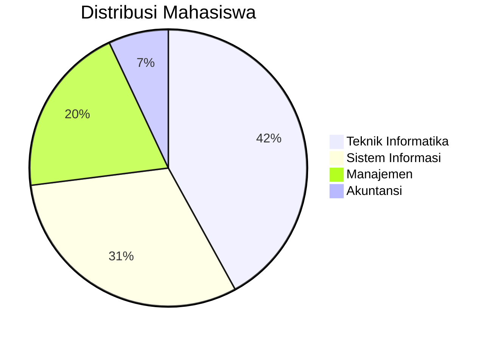
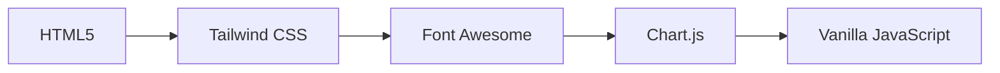
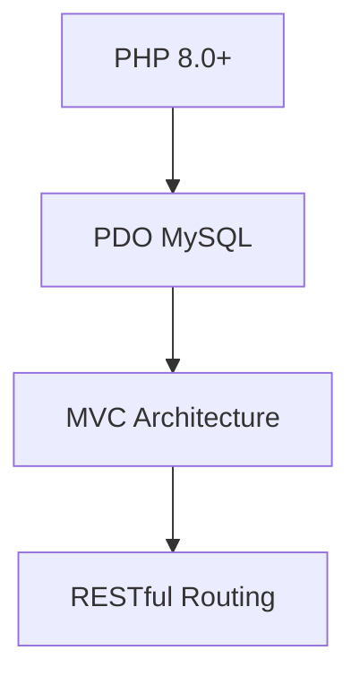

# **🎓 Aplikasi Manajemen Data Mahasiswa**  
**Dibuat oleh Arya Wardhana**  

  
  
  
  

---

## **🌟 Fitur Utama**

### **🛠️ Operasi Dasar**
| Fitur | Deskripsi | Teknologi |
|-------|-----------|-----------|
| **Create** | Tambah data mahasiswa lengkap | Form Validation |
| **Read** | Tampilan data dengan pagination | PHP PDO |
| **Update** | Edit semua field termasuk foto | AJAX Upload |
| **Delete** | Hapus data dengan konfirmasi | SweetAlert |

### **🔍 Pencarian & Filter**
- 🔎 Pencarian real-time (Nama, NIM, Jurusan)
- 🗂 Filter multi-kriteria (Angkatan, Jenis Kelamin)
- 🏷 Sistem tagging jurusan otomatis

### **📊 Dashboard & Analitik**


### **🎨 Tampilan Interaktif**
- 🌙 **Dark Mode** dengan sistem penyimpanan cookie
- 📱 **Responsive Design** (Mobile, Tablet, Desktop)
- 🎚 **Sorting Data** dengan indikator visual
- 💅 **Animasi Modern** menggunakan Tailwind CSS

### **📁 Ekspor Data**
| Format | Fitur | Ikon |
|--------|-------|------|
| Excel | Export semua data dengan styling | 📊 |
| PDF | Generate laporan profesional | 📄 |
| Print | Cetak langsung dari browser | 🖨️ |

---

## **🖼️ Screenshot Aplikasi**

<div align="center">
  
  
  
  
  
</div>

---

## **⚙️ Teknologi Stack**

### **Frontend**


### **Backend**


### **Keamanan**
- 🔒 Prepared Statements
- 🛡️ Input Sanitization
- 🔐 CSRF Protection
- 📛 XSS Prevention

---

## **🚀 Panduan Instalasi**

### **Prasyarat**
1. Web Server (Apache/Nginx)
2. PHP ≥ 8.0
3. MySQL ≥ 5.7
4. Composer (untuk autoloading)

### **Langkah Instalasi**
```bash
# Clone repository
git clone https://github.com/username/crud-mahasiswa.git
cd crud-mahasiswa

# Install dependencies
composer install

# Setup database
mysql -u root -p crud_mvc < database.sql

# Konfigurasi
cp config/database.example.php config/database.php
nano config/database.php
```

### **Struktur File Penting**
```
.
├── app/
│   ├── core/       # Sistem MVC
│   ├── models/     # Model database
│   └── views/      # Template tampilan
├── assets/         # CSS & JS
├── config/         # Konfigurasi
├── uploads/        # Penyimpanan file
└── public/         # Document root
```

---

## **📚 Dokumentasi API**

### **Endpoint CRUD**
```http
GET    /mahasiswa          # List semua data
POST   /mahasiswa          # Tambah data baru
GET    /mahasiswa/{id}     # Detail mahasiswa
PUT    /mahasiswa/{id}     # Update data
DELETE /mahasiswa/{id}     # Hapus data
```

### **Contoh Response**
```json
{
  "success": true,
  "data": {
    "id": 1,
    "nama": "John Doe",
    "nim": "20210001",
    "jurusan": "Teknik Informatika",
    "foto": "uploads/photo_1.jpg"
  }
}
```

---

## **🛠 Troubleshooting**

| Masalah | Solusi |
|---------|--------|
| Foto tidak terupload | Cek permission folder `uploads/` |
| Export error | Install PHP extensions: mbstring, dom |
| Dark mode tidak berfungsi | Enable JavaScript di browser |
| Koneksi database gagal | Verifikasi credential di `config/database.php` |

---

## **📜 Lisensi**

MIT License © 2025 Muhammad Alhafiz Arya Wardhana

```text
Dilarang menggunakan projek ini untuk:
- Aktivitas illegal
- Plagiarisme
- Tujuan komersial tanpa izin
```

---

## **💌 Kontak & Dukungan**

<div align="center">
  <a href="mailto:email@anda.com">
    
  </a>
  <a href="https://github.com/username">
    
  </a>
  <a href="https://linkedin.com/in/username">
    
  </a>
</div>

---

**🎨 "Kode yang indah adalah seni yang fungsional"**  
**🔥 Happy Coding!** 🔥
